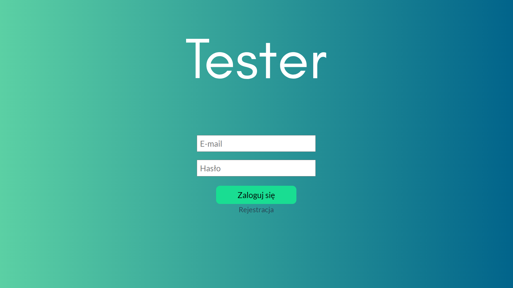

<h1 align="center">Tester</h1> 
<h2 align="center">Description</h2>

Tester is a website with which you can conduct safe online tests. We constantly improve the design and add new functionalities.

<h2 align="center">Installation</h2>

You must to write this line in consol to install Laravel folder  <code>composer intsall</code>

    
<h2 align="center">Images</h2>

  

